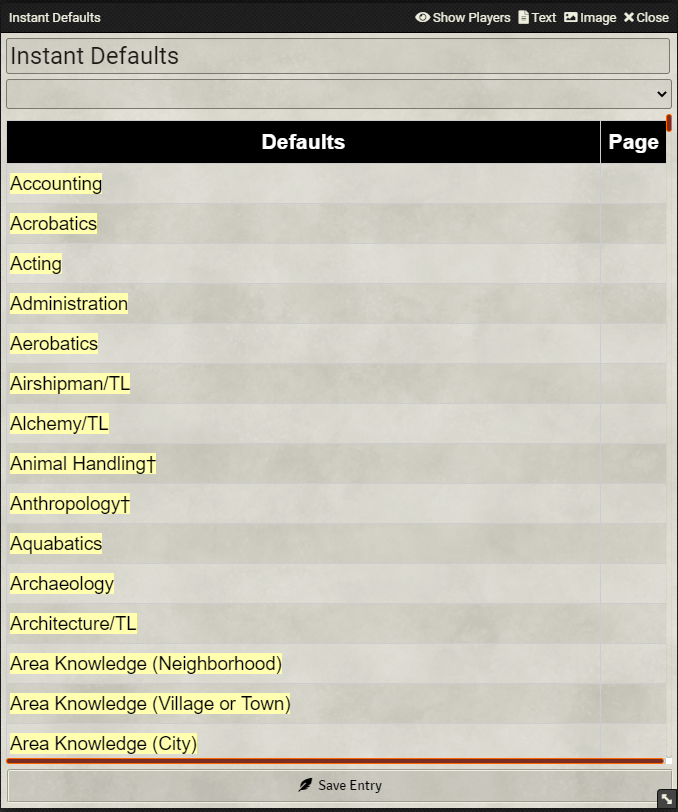

# GURPS Instant Defaults is a Module for Foundry VTT 
Works with **GGA**  System! It provides a full list os default skills and some itens to make your game more fast! 

<table>
<thead>
  <tr>
    <th>

    

</th>
 </thead>
 </table>
    

# Manifest:
https://raw.githubusercontent.com/cefasheli/Gurps_Instant_Defaults/main/module.json

*How to use it

# Legal

The material presented here is our original creation, offered trough On the fly formulas made by  [Gurps Game Aid](https://github.com/crnormand/gurps) and is  intended for use with the GURPS system from Steve Jackson Games. This material is not official and is not endorsed by Steve Jackson Games.
GURPS is a trademark of Steve Jackson Games, and its rules and art are copyrighted by Steve Jackson Games. All rights are reserved by Steve Jackson Games. 
The GURPS Instant Defaults was released for free distribution, and not for resale, under the permissions granted in the Steve Jackson Games Online Policy
This module DOES NOT provide information contained in paid publications. It is only intended to allow people to play GURPS online using their GURPS books/PDFs.

